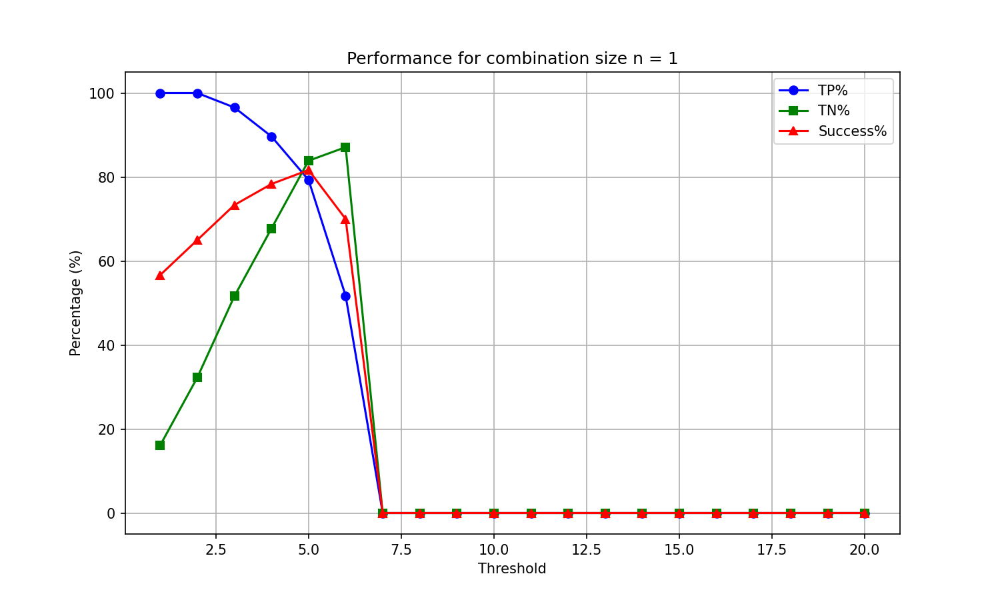
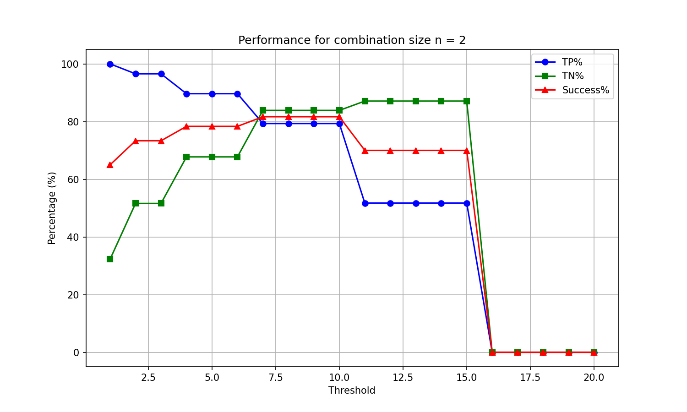
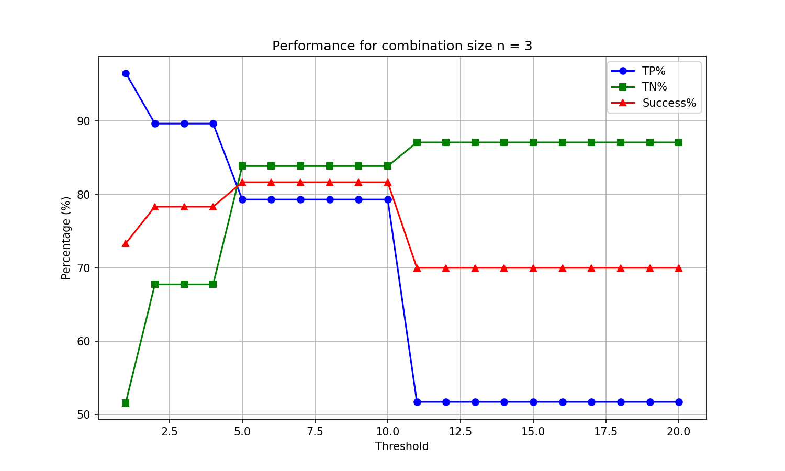
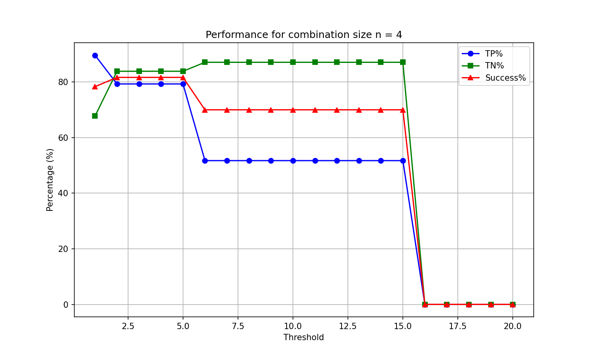
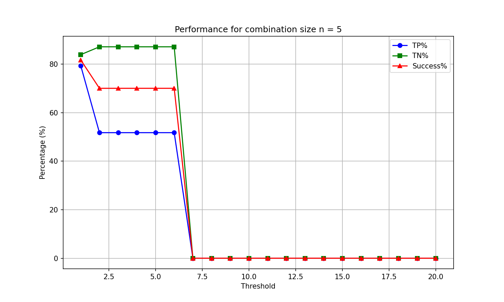
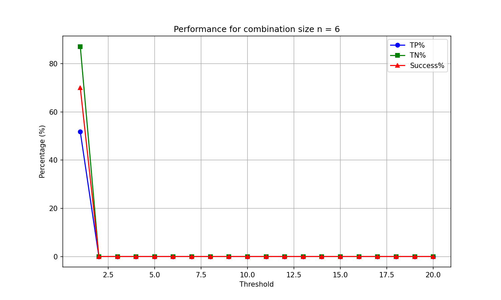

# Configuration Performance Report

This report summarizes the best thresholds for each combination size (n) and highlights the overall best configuration.

## Configuration n = 1

| Metric | Best Threshold | Value | Percentage |
|--------|----------------|-------|------------|
| True Positives (TP) | 1 | 29 | 100.0% |
| True Negatives (TN) | 6 | 27 | 87.1% |
| Success (TP+TN) | 5 | 49 | 81.7% |

## Configuration n = 2

| Metric | Best Threshold | Value | Percentage |
|--------|----------------|-------|------------|
| True Positives (TP) | 1 | 29 | 100.0% |
| True Negatives (TN) | 11 | 27 | 87.1% |
| Success (TP+TN) | 7 | 49 | 81.7% |

## Configuration n = 3

| Metric | Best Threshold | Value | Percentage |
|--------|----------------|-------|------------|
| True Positives (TP) | 1 | 28 | 96.6% |
| True Negatives (TN) | 11 | 27 | 87.1% |
| Success (TP+TN) | 5 | 49 | 81.7% |

## Configuration n = 4

| Metric | Best Threshold | Value | Percentage |
|--------|----------------|-------|------------|
| True Positives (TP) | 1 | 26 | 89.7% |
| True Negatives (TN) | 6 | 27 | 87.1% |
| Success (TP+TN) | 2 | 49 | 81.7% |

## Configuration n = 5

| Metric | Best Threshold | Value | Percentage |
|--------|----------------|-------|------------|
| True Positives (TP) | 1 | 23 | 79.3% |
| True Negatives (TN) | 2 | 27 | 87.1% |
| Success (TP+TN) | 1 | 49 | 81.7% |

## Configuration n = 6

| Metric | Best Threshold | Value | Percentage |
|--------|----------------|-------|------------|
| True Positives (TP) | 1 | 15 | 51.7% |
| True Negatives (TN) | 1 | 27 | 87.1% |
| Success (TP+TN) | 1 | 42 | 70.0% |

## Overall Best Configuration(s)

| n | Threshold | TP (%) | TP (count) | TN (%) | TN (count) | Success (%) |
|---|-----------|--------|------------|--------|------------|-------------|
| 1 | 5 | 79.3% | 23/29 | 83.9% | 26/31 | 81.7% |
| 2 | 7 | 79.3% | 23/29 | 83.9% | 26/31 | 81.7% |
| 3 | 5 | 79.3% | 23/29 | 83.9% | 26/31 | 81.7% |
| 4 | 2 | 79.3% | 23/29 | 83.9% | 26/31 | 81.7% |
| 5 | 1 | 79.3% | 23/29 | 83.9% | 26/31 | 81.7% |

