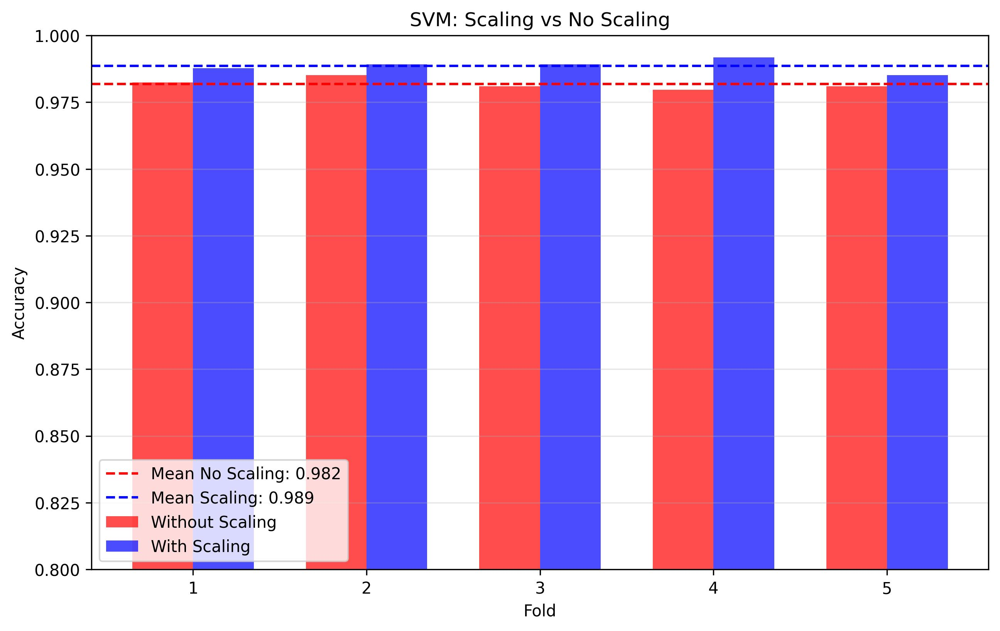
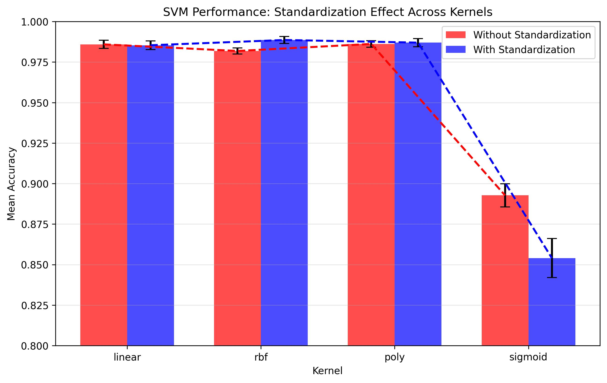
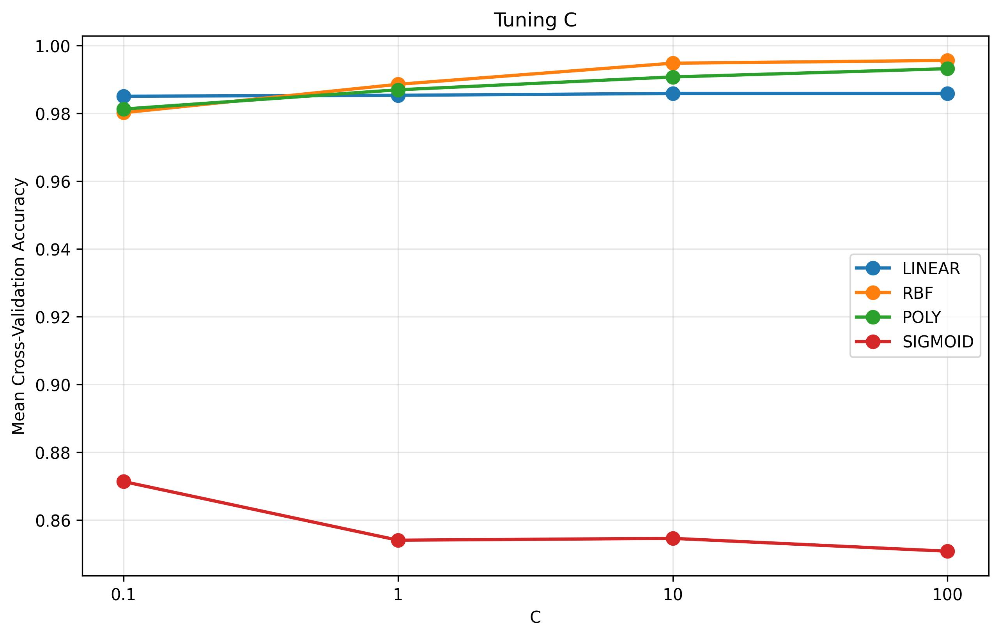
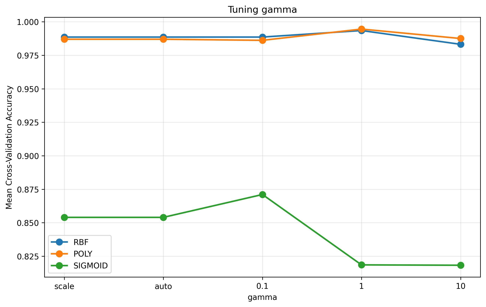
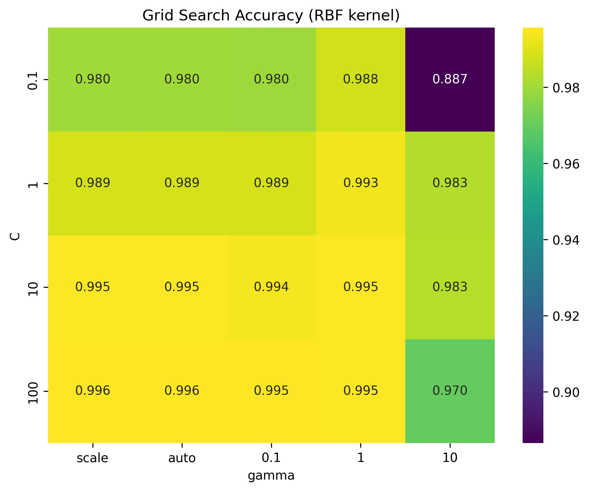
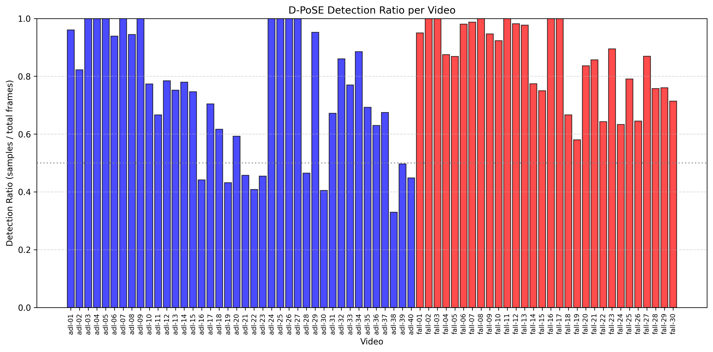

# SVM Fall Detector – Validation Results Summary (URFD dataset)

## METHOD

URFD dataset has 30 fall and 40 ADL videos at 30 FPS.
Labels: 
    1   ->  lying,
    -1  ->  not lying,
    0   ->  intermediate state

1.  Neighbouring frames are similar, so we take only odd‑numbered frames per video, resulting in 15 FPS
2.  Process with D‑PoSE. Here, many frames resulted in "No Detection". Noticed this often happened when 
    the head, for example, was not visible due to the person lying down, etc.
3.  Execute Recognizers to get one .csv per video with the result numbers from the recognizers and the labels. 
    Ignoring frames with label=0 (also dictated in the dataset description)
4.  Aggregate all frame results and split in 5 random groups for cross validation.
5.  Train SVM and test parameters as so:
        1) train on 4 folds
        2) test on last fold
        3) repeat.
    And report results: Accuracy and Standard Deviation across test-fold sets.

## 1. Standardization 

a.k.a. feature scaling (on the RBF Kernel)

| Scaling        | Mean Accuracy | Std Deviation |
|----------------|---------------|----------------|
| Without scaling| 0.9819        | 0.0018         |
| With scaling   | 0.9886        | 0.0022         |

Scaling => +0.0067

---

## 2. Standardization Across All Kernels

Comparison of four SVM kernels with and without scaling. 

| Kernel   | No Scaling (mean ± std)      | With Scaling (mean ± std)     |
|----------|------------------------------|-------------------------------|
| Linear   | 0.9859 ± 0.0025              | 0.9854 ± 0.0026               |
| RBF      | 0.9819 ± 0.0018              | 0.9886 ± 0.0022               |
| Poly     | 0.9862 ± 0.0020              | 0.9870 ± 0.0025               |
| Sigmoid  | 0.8927 ± 0.0072              | 0.8540 ± 0.0120               |

RBF and poly benefit. RBF benefits more

---

## 3. C Parameter 

Test C parameter per kernel (with Scaling)

| Kernel   | Best C | Best Accuracy |
|----------|--------|----------------|
| Linear   | 10     | 0.9859         |
| RBF      | 100    | 0.9957         |
| Poly     | 100    | 0.9932         |
| Sigmoid  | 0.1    | 0.8713         |

Again RBF and Poly perform the best with C=100

---

## 4. Gamma Parameter 

Test Gamma parameter per kernel (with Scaling)

| Kernel   | Best Gamma | Best Accuracy |
|----------|------------|----------------|
| RBF      | 1          | 0.9935         |
| Poly     | 1          | 0.9946         |
| Sigmoid  | 0.1        | 0.8711         |

RBF and Poly perform the best with Gamma=1

---

## 5. GridSearchCV

Run GridSearchCV to conclude on best parameters:

- Best kernel: RBF + standardization
- Best parameters: C: 100, gamma: 'scale'
- Best cross‑validation accuracy: 0.9957

## 6. D-PoSE No-Detection

All the above stats and numbers are calculated only from the 
frames that actualy did have a detection from D-PoSE. This should 
dilute the scores, because any no detection should be considered 
false detection from the system.

Below is the graph of how many frames had successful detection.

